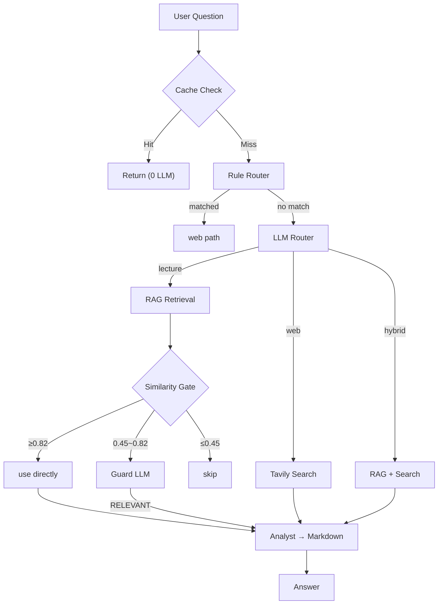
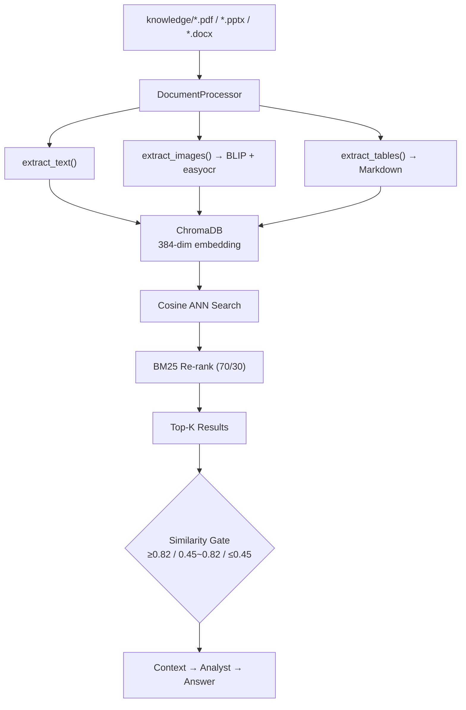

# LectureCrewLLM

[English](README.md) | [中文](README_CN.md) | [BUG_REPORT](md/BUG_REPORT.md) ｜ [架构图](md/diagrams.md) ｜ [未来设想图](md/feture.md)

**Multi-Agent Lecture Analysis System** — Multi-modal RAG (text + images + tables) + web search + interactive Web UI

Built with CrewAI, ChromaDB, and Flask. Uses DeepSeek as the LLM, sentence-transformers for cross-lingual embeddings, and BLIP for image captioning.

---

## Features

- **Multi-Agent Architecture** — Intent routing → RAG retrieval → relevance verification → analyst, intelligent orchestration
- **Multi-Modal RAG** — Extracts text (semantic chunking), images (BLIP captions), and tables (Markdown) from PDF/PPTX/DOCX
- **Web Search** — Tavily API real-time search, toggle on/off, auto-cached (1h TTL), results persisted to RAG for future queries
- **Smart Caching** — Answer cache (30-day TTL, punctuation/stopword tolerant) + retrieval cache + search cache + web→RAG persistence — 4-tier caching
- **SSE Real-Time Progress** — 4-step progress bar + timer + rotating tips, live execution status in Web UI
- **File Management** — Upload, delete, reindex; incremental indexing processes only changed files
- **Multi-Session** — Persistent conversation history, session switching, creation, and deletion
- **History Search** — CLI `find` command + Web UI sidebar search, cross-session full-text search, click-to-jump
- **Auto Geo-Location** — Browser Geolocation API auto-detects city, no manual input needed
- **Visual Intent Routing** — Queries like "show Transformer architecture diagram" auto-route to image retrieval, bypassing similarity gate
- **OCR Text Extraction** — easyocr extracts embedded Chinese/English text from diagrams and screenshots
- **Graceful Degradation** — Falls back to lecture-only answers when web search fails
- **Server-Side Markdown** — Python-Markdown renders answers to HTML on the backend, replacing ~165 lines of fragile frontend JS

---

## Tech Stack

| Layer | Technology | Version | Purpose |
|-------|-----------|---------|---------|
| **LLM** | DeepSeek Chat API | — | Primary language model (configurable via `LLM_MODEL`) |
| **Agent Framework** | [CrewAI](https://github.com/crewAIInc/crewAI) | 1.14.3 | Multi-agent orchestration (sequential process) |
| **Vector DB** | [ChromaDB](https://www.trychroma.com/) | 1.1.1 | Persistent vector storage + cosine ANN search |
| **Embeddings** | [sentence-transformers](https://sbert.net/) | 5.4.1 | `paraphrase-multilingual-MiniLM-L12-v2` (384-dim) |
| **Re-ranking** | BM25 Okapi (scikit-learn) | 1.8.0 | Statistical re-rank fused with embedding similarity (70/30) |
| **Image Caption** | [BLIP](https://huggingface.co/Salesforce/blip-image-captioning-base) (transformers) | 5.7.0 | Image → text description for RAG indexing |
| **OCR** | [easyocr](https://github.com/JaidedAI/EasyOCR) | 1.7.2 | Embedded text extraction from diagrams/screenshots |
| **Deep Learning** | [PyTorch](https://pytorch.org/) | 2.11.0 | Backend for sentence-transformers and BLIP |
| **Document Parsing** | [PyMuPDF](https://pymupdf.readthedocs.io/) | 1.26.7 | PDF extraction |
| | [python-pptx](https://python-pptx.readthedocs.io/) | 1.0.2 | PPTX extraction |
| | [python-docx](https://python-docx.readthedocs.io/) | 1.2.0 | DOCX extraction |
| **Web Search** | [Tavily](https://tavily.com/) | 0.7.24 | Real-time web search API |
| **Web UI** | [Flask](https://flask.palletsprojects.com/) | 3.0.0 | HTTP server + REST API |
| | Server-Sent Events (SSE) | — | Real-time progress streaming |
| | Font Awesome (CDN) | 6.4.0 | Icons |
| **Markdown** | [Python-Markdown](https://python-markdown.github.io/) | 3.10.2 | Server-side Markdown→HTML (GFM tables + code blocks) |
| **Chinese NLP** | [jieba](https://github.com/fxsjy/jieba) | — | Chinese word segmentation for cache matching |
| **Cache** | JSON file-based | — | 4-tier: answer + retrieval + search + web→RAG |
| **Testing** | [pytest](https://pytest.org/) | 9.0.3 | 150 unit tests across 8 modules |
| **Env Config** | [python-dotenv](https://github.com/theskumar/python-dotenv) | 1.2.2 | `.env` variable management |

---

## System Architecture

### Request Flow

<details open>
<summary>Mermaid</summary>



</details>

### Agent Roles

| Agent | Role | LLM | Tokens |
|-------|------|-----|--------|
| **🎯 Router** | Classify intent: lecture / web / hybrid / unknown | DeepSeek, temp=0.1 | ~50 |
| **✅ Guard** | Verify RAG results are semantically relevant (not just keyword overlap) | DeepSeek, temp=0.1 | ~200 |
| **📝 Analyst** | Synthesize RAG + search results into structured Chinese Markdown | DeepSeek, temp=0.7 | ~1000-2000 |

### Multi-Modal RAG Pipeline

<details open>
<summary>Mermaid</summary>



</details>

### Similarity Gate

Three-tier threshold to avoid unnecessary LLM calls:

- **≥0.82** → High confidence, skip Guard LLM, send directly to Analyst (saves ~2s)
- **0.45 ~ 0.82** → Borderline, call Guard Agent for LLM semantic verification
- **≤0.45** → Low confidence, skip Guard and Analyst (no relevant content)

### ChromaDB Entry

```
{
  id:        "lecture1_text_3"           # {stem}_{type}_{index}
  document:  "The core of Transformer is self-attention..."
  metadata: {
    type:        "text"                  # text | image | table | web
    source:      "knowledge/lecture1.pptx"  # or "web_search:{hash}" for web results
    chunk_index: 3
    indexed_at:  "2026-05-26T10:30:00"
    image_path:  "images/...png"         # image type only
  }
  vector:    [0.123, 0.456, ...]         # 384-dim
}
```

---

## Quick Start

### Prerequisites

- Python 3.11+
- DeepSeek API Key — [platform.deepseek.com](https://platform.deepseek.com/api_keys)
- Tavily API Key — [app.tavily.com](https://app.tavily.com) (for web search)

### Setup

```bash
# 1. Clone the project
cd lecture_crewLLM

# 2. Configure environment
cp .env.example .env
# Edit .env with your API keys: DEEPSEEK_API_KEY, TAVILY_API_KEY, FLASK_SECRET_KEY

# 3. Install dependencies
pip install -r requirements.txt

# 4. Place lecture files in knowledge/
mkdir -p knowledge
```

### Run

```bash
# Web UI (recommended)
python web_ui.py
# Open http://localhost:7860

# CLI mode
python main.py
```

### Run Tests

```bash
python -m pytest tests/ -v
# 150 tests across 8 modules
```

---

## Project Structure

```
lecture_crewLLM/
├── main.py                      # CLI entry + agent orchestration + routing
├── web_ui.py                    # Flask Web UI + REST API + SSE streaming
├── requirements.txt             # Locked dependency versions
├── .env.example                 # Environment variable template
│
├── tools/
│   ├── rag_store.py             # ChromaDB vector store + BM25 hybrid retrieval
│   ├── document_processor.py    # Document parsing (PDF/PPTX/DOCX) + semantic chunking
│   ├── image_captioner.py       # BLIP image caption + easyocr text extraction
│   ├── conversation_manager.py  # Conversation persistence (≤300 token summary)
│   ├── session_manager.py       # Multi-session creation & management
│   ├── answer_cache.py          # Answer cache (TTL 30-day, exact hash + similarity fallback)
│   ├── local_file_tool.py       # Local file reader (CrewAI Tool compatible)
│   └── status_tracker.py        # SSE progress tracker
│
├── tests/
│   ├── test_rag.py              # RAG tests (47)
│   ├── test_answer_cache.py     # Cache tests (12)
│   ├── test_conversation_manager.py  # Conversation tests (16)
│   ├── test_session_manager.py       # Session tests (15)
│   ├── test_status_tracker.py        # SSE tracker tests (6)
│   ├── test_local_file_tool.py       # File tool tests (3)
│   └── test_web_api.py               # Flask API tests (51)
│
├── md/                          # Documentation & diagrams
│   ├── BUG_REPORT.md            # Bug report
│   ├── diagrams.md              # Mermaid source (5 diagram types)
│   └── feture.md                # Future roadmap
│
├── presentation/                # Presentation materials
│   ├── PROJECT_SLIDES.md        # Slide content
│   └── LectureCrewLLM.pdf       # Exported PDF
│
├── templates/index.html         # Web UI template (server-rendered HTML + SSE)
├── static/
│   ├── style.css                # Stylesheet
│   └── script.js                # Frontend logic (receives pre-rendered HTML from backend)
│
├── knowledge/                   # Lecture files (PDF/PPTX/DOCX)
├── images/                      # Extracted images (auto-created)
├── chroma_db/                   # ChromaDB persistence (auto-created)
├── conversations/sessions/      # Session files (auto-created)
├── cache/                       # Answer/retrieval/search caches (auto-created)
└── output/                      # Timestamped answer exports (auto-created)
```

---

## Configuration

| Variable | Required | Description | Default |
|----------|----------|-------------|---------|
| `DEEPSEEK_API_KEY` | Yes | DeepSeek API key | — |
| `LLM_MODEL` | No | LLM model identifier (provider/model format) | `deepseek/deepseek-chat` |
| `TAVILY_API_KEY` | No | Tavily search API key (omit if not using web search) | — |
| `FLASK_SECRET_KEY` | Yes* | Flask session signing key. Generate: `python -c "import secrets; print(secrets.token_hex(32))"` | — |
| `WEB_UI_PORT` | No | Web UI port | `7860` |
| `FLASK_DEBUG` | No | Debug mode | `0` |

\* Required for Web UI. Server refuses to start without it.

---

## REST API

| Method | Path | Description |
|--------|------|-------------|
| `GET` | `/api/status` | System status |
| `GET` | `/api/sessions` | List sessions |
| `POST` | `/api/sessions` | Create session |
| `POST` | `/api/sessions/<path>` | Switch session |
| `DELETE` | `/api/sessions/<path>` | Delete session |
| `GET` | `/api/chat/task` | Get SSE task ID |
| `POST` | `/api/chat` | Send message |
| `GET` | `/api/chat/stream` | SSE progress stream |
| `GET` | `/api/history` | Conversation history |
| `GET` | `/api/history/search` | Search history (`?q=keyword&all=true`) |
| `DELETE` | `/api/history` | Clear history |
| `GET` | `/api/knowledge` | List files |
| `POST` | `/api/knowledge/upload` | Upload file |
| `DELETE` | `/api/knowledge/<filename>` | Delete file |
| `POST` | `/api/knowledge/reindex` | Force reindex |
| `GET` | `/api/cache` | Cache stats |
| `DELETE` | `/api/cache` | Clear cache |
| `GET` | `/images/<filename>` | Extracted image files |

---

## Key Design Decisions

| Decision | Approach | Rationale |
|----------|----------|-----------|
| **Sequential vs Hierarchical** | Sequential pipeline (route→verify→analyze) | Hierarchical adds 3 extra Manager calls (~24s), Sequential: 2-3 calls (~8s) |
| **Image retrieval** | BLIP caption → vectorize text | Avoids multi-modal embedding model; 384-dim is sufficient |
| **Semantic chunking** | Paragraph/heading boundaries, 100-1200 chars | Respects document structure instead of fixed-length splits |
| **Re-ranking** | Embedding similarity + BM25 fusion (70/30) | Removed CrossEncoder (saves 1-2s/query), BM25 is sufficient |
| **Similarity gate** | 3-tier thresholds (≥0.82 / 0.45-0.82 / ≤0.45) | Reduces unnecessary Guard LLM calls; only borderline cases need it |
| **Routing** | Rule-based keyword match → LLM fallback | Zero LLM cost for weather/news/stock queries |
| **Cache normalization** | MD5(dedupe + sort + strip stopwords/punctuation) | "What is BERT?" ≡ "BERT explained" → same cache hit |
| **Cache similarity threshold** | Jaccard + coverage fusion, threshold 0.65 | Prevents false positive matches like "水原天气" ↔ "明天天气" |
| **Web search persistence** | Store search results in RAG with type="web" | Similar future queries hit RAG instead of re-calling Tavily API |
| **Model via env** | `LLM_MODEL` env var | Switch provider/model without code changes |
| **Single-file indexing** | `index_file()` indexes one file without directory scan | Upload API: O(N)→O(1); skips SHA256 of every file in knowledge/ |
| **Batch BLIP inference** | Pipeline batch mode (list of images) instead of sequential loop | 2-5× speedup for multi-image documents (e.g., PPTX with 10+ images) |
| **Sidebar auto-refresh** | `loadCacheStats()` + `loadKnowledge()` after every mutation | Cache count and file list update in real-time without manual refresh |
| **Server-side Markdown** | Python-Markdown renders on backend, frontend uses `innerHTML` directly | Removed ~165 lines of self-built JS renderer; eliminates regex/placeholder bugs; full GFM support |

---

## Test Coverage

| Module | Count | Coverage |
|--------|-------|----------|
| `test_rag.py` | 47 | Semantic chunking, table conversion, document dispatch, image captioning, vector CRUD, hybrid retrieval, web→RAG indexing, single-file indexing, filename safety, path hashing, keyword boost, cache key isolation |
| `test_answer_cache.py` | 12 | Cache hit/expiry/overwrite, punctuation tolerance, stopword filtering, jieba semantic matching |
| `test_conversation_manager.py` | 16 | Message CRUD, persistence, context formatting, search |
| `test_session_manager.py` | 15 | Session create/list/label/delete, cross-session search |
| `test_status_tracker.py` | 6 | SSE progress tracking, concurrency |
| `test_local_file_tool.py` | 3 | PDF/PPTX reading, missing file handling |
| `test_web_api.py` | 51 | Flask API + HTML template + SSE + chat + session/knowledge/image endpoints, image validation, search cache resilience, web entry filtering |
| **Total** | **150** | All passing |

---

## Troubleshooting

| Problem | Solution |
|---------|----------|
| Vector DB errors | `rm -rf chroma_db/` and restart to reindex |
| API key errors | Check `.env` keys are set and valid |
| Port already in use | Change `WEB_UI_PORT` in `.env` |
| BLIP model issues | Falls back to `[Image: WxH px]` placeholder |
| Corrupted sessions | Delete `conversations/` directory |

---

## Development History

| Phase | Highlights |
|-------|-----------|
| **Foundation** | CrewAI + ChromaDB + DeepSeek + Flask Web UI + CLI |
| **RAG Enhancement** | Semantic chunking, BLIP image captions, table Markdown, DOCX support |
| **Performance** | Sequential replaces Hierarchical (5→2 LLM calls), CrossEncoder removed (saves 1-2s/query), RAG context halved (4000→2000 chars), multi-tier cache |
| **UX Polish** | Chinese UI, SSE 4-step progress, live timer, rotating tips, Markdown export |
| **Smart Routing** | Rule-based + LLM dual routing, Grounding Check, 3-tier similarity gate |
| **Stability** | Image URL encoding, path traversal guard, filename sanitization, auto cache cleanup |
| **Interaction** | History search (CLI `find` + Web UI sidebar), click-to-jump results, browser auto-location |
| **Upload Pipeline** | Single-file index `index_file()`, batch BLIP, sidebar auto-refresh | Upload O(N)→O(1), BLIP 2-5× faster, live cache/knowledge panel updates |
| **Test Hardening** | 131→150 tests, 19 new regression tests targeting 10 previously-untested bugs | Keyword boost, filename safety, image validation, cache resilience, web entry filtering |

---

## Star History

<a href="https://www.star-history.com/?repos=spirit-revenge%2Fmulti-agent.git&type=date&legend=top-left">
 <picture>
   <source media="(prefers-color-scheme: dark)" srcset="https://api.star-history.com/chart?repos=spirit-revenge/multi-agent.git&type=date&theme=dark&legend=top-left" />
   <source media="(prefers-color-scheme: light)" srcset="https://api.star-history.com/chart?repos=spirit-revenge/multi-agent.git&type=date&legend=top-left" />
   
 </picture>
</a>

---

> [!NOTE]
> This project is for learning purposes. It contains many bugs and unimplemented features, so please do not use it in actual production environments. Feel free to reach out for discussion at any time.

---

*Last updated: June 2026*
