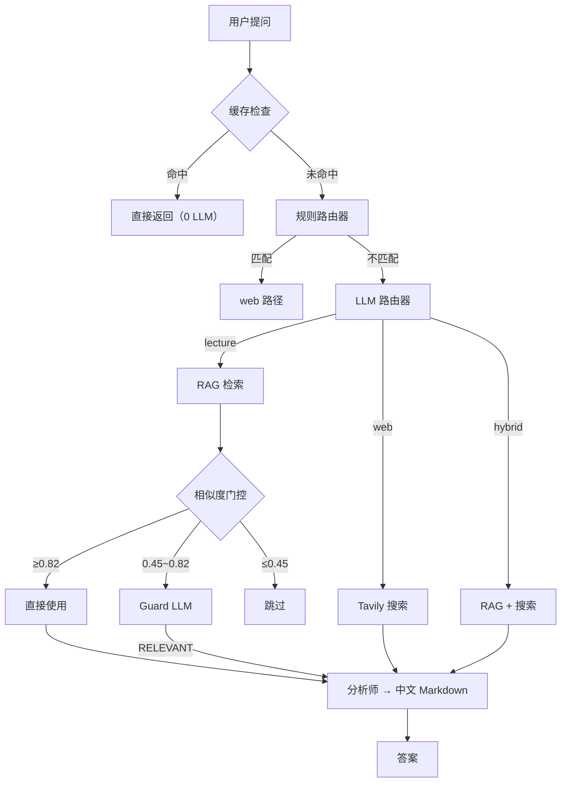
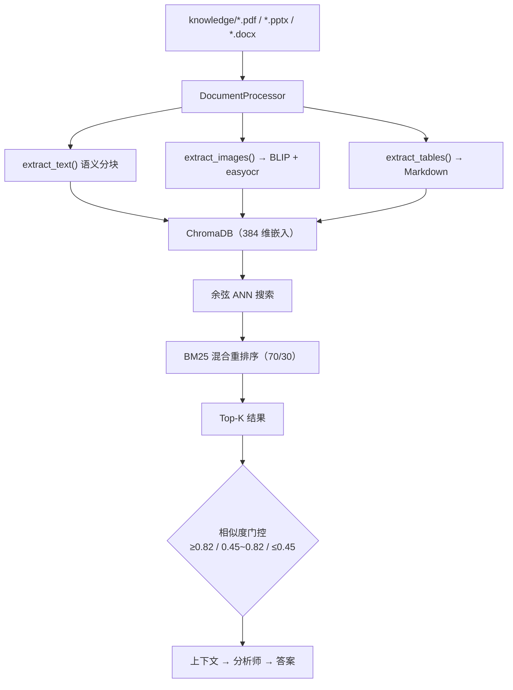

# LectureCrewLLM

[English](README.md) | [中文](README_CN.md) | [BUG_REPORT](BUG_REPORT.md) ｜ [架构图](picts/diagrams.md)

**多智能体讲座分析系统** — 多模态 RAG（文本 + 图片 + 表格）+ 联网搜索 + 交互式 Web UI

基于 CrewAI、ChromaDB 和 Flask 构建。使用 DeepSeek 作为 LLM，sentence-transformers 实现跨语言嵌入，BLIP 实现图片描述生成。

---

## 功能特性

- **多智能体协作** — 意图路由 → RAG 检索 → 相关性验证 → 分析师生成答案，智能编排流程
- **多模态 RAG** — 从 PDF/PPTX/DOCX 中提取文本（语义分块）、图片（BLIP 描述）、表格（Markdown），统一向量化检索
- **联网搜索** — Tavily API 实时搜索，支持手动开关，自动缓存（1h TTL），结果持久化到 RAG 供未来查询复用
- **智能缓存** — 答案缓存（30 天 TTL，标点/停用词容忍）+ 检索缓存 + 搜索缓存 + web→RAG 持久化，四级缓存避免冗余调用
- **SSE 实时进度** — 4 步进度条 + 计时器 + 轮播提示，Web UI 实时展示执行状态
- **文件管理** — 上传、删除、重建索引，增量索引仅处理变更文件
- **多会话管理** — 持久化对话历史，支持会话切换、新建、删除
- **历史搜索** — CLI `find` 命令 + Web UI 侧边栏搜索，支持跨会话全文检索，点击结果一键跳转
- **自动定位** — 浏览器 Geolocation API 自动获取城市位置，无需手动设置
- **优雅降级** — 搜索失败时自动回退到仅讲座内容，缓存自动清理

---

## 技术栈

| 层级 | 技术 | 版本 | 用途 |
|------|------|------|------|
| **LLM** | DeepSeek Chat API | — | 主力语言模型（可通过 `LLM_MODEL` 切换） |
| **Agent 框架** | [CrewAI](https://github.com/crewAIInc/crewAI) | 1.14.3 | 多智能体编排（sequential process） |
| **向量数据库** | [ChromaDB](https://www.trychroma.com/) | 1.1.1 | 持久化向量存储 + 余弦相似度 ANN 搜索 |
| **嵌入模型** | [sentence-transformers](https://sbert.net/) | 5.4.1 | `paraphrase-multilingual-MiniLM-L12-v2` (384维) |
| **重排序** | BM25 Okapi (scikit-learn) | 1.8.0 | 统计重排序与嵌入相似度融合 (70/30) |
| **图片描述** | [BLIP](https://huggingface.co/Salesforce/blip-image-captioning-base) (transformers) | 5.7.0 | 图片 → 文字描述，用于 RAG 索引 |
| **深度学习** | [PyTorch](https://pytorch.org/) | 2.11.0 | sentence-transformers 和 BLIP 的后端 |
| **文档解析** | [PyMuPDF](https://pymupdf.readthedocs.io/) | 1.26.7 | PDF 提取 |
| | [python-pptx](https://python-pptx.readthedocs.io/) | 1.0.2 | PPTX 提取 |
| | [python-docx](https://python-docx.readthedocs.io/) | 1.2.0 | DOCX 提取 |
| **联网搜索** | [Tavily](https://tavily.com/) | 0.7.24 | 实时网络搜索 API |
| **Web UI** | [Flask](https://flask.palletsprojects.com/) | 3.0.0 | HTTP 服务器 + REST API |
| | Server-Sent Events (SSE) | — | 实时进度推送 |
| | Font Awesome (CDN) | 6.4.0 | 图标 |
| **中文分词** | [jieba](https://github.com/fxsjy/jieba) | — | 中文分词（缓存匹配用） |
| **缓存** | JSON 文件存储 | — | 四级：答案 + 检索 + 搜索 + web→RAG |
| **测试** | [pytest](https://pytest.org/) | 9.0.3 | 101 个单元测试，覆盖 8 个模块 |
| **环境配置** | [python-dotenv](https://github.com/theskumar/python-dotenv) | 1.2.2 | `.env` 变量管理 |

---

## 系统架构

### 请求流程

<details open>
<summary>Mermaid</summary>



</details>

### Agent 角色

| Agent | 职责 | LLM | Token |
|-------|------|-----|-------|
| **🎯 意图路由器 (Router)** | 判断问题类别：lecture / web / hybrid / unknown | DeepSeek, temp=0.1 | ~50 |
| **✅ 相关性验证员 (Guard)** | 边界案例判断 RAG 结果是否语义相关（区分关键词重叠） | DeepSeek, temp=0.1 | ~200 |
| **📝 讲座分析师 (Analyst)** | 综合 RAG + 搜索信息，生成结构化中文 Markdown 回答 | DeepSeek, temp=0.7 | ~1000-2000 |

### 多模态 RAG 管道

<details open>
<summary>Mermaid</summary>



</details>

### 判定门控原理

相似度阈值分为三档，避免不必要的 LLM 调用：

- **≥0.82** → 高置信度匹配，跳过 Guard LLM，直接送入 Analyst（节省 ~2s）
- **0.45 ~ 0.82** → 边界案例，调用 Guard Agent 做 LLM 语义验证（关键词重叠 vs 真正相关）
- **≤0.45** → 低置信度，跳过 Guard 和 Analyst（无相关内容）

### 数据存储结构

```
{
  id:        "lecture1_text_3"           # {文件名}_{类型}_{索引}
  document:  "Transformer 的核心是自注意力机制..."
  metadata: {
    type:        "text"                  # text | image | table | web
    source:      "knowledge/lecture1.pptx"  # 或 "web_search:{hash}"（web 搜索结果）
    chunk_index: 3
    indexed_at:  "2026-05-26T10:30:00"
    image_path:  "images/...png"         # 仅 image 类型
  }
  vector:    [0.123, 0.456, ...]         # 384 维
}
```

---

## 快速开始

### 环境要求

- Python 3.11+
- DeepSeek API Key — [platform.deepseek.com](https://platform.deepseek.com/api_keys)
- Tavily API Key — [app.tavily.com](https://app.tavily.com)（联网搜索需要）

### 安装

```bash
cd lecture_crewLLM
cp .env.example .env
# 编辑 .env 填入 DEEPSEEK_API_KEY、TAVILY_API_KEY、FLASK_SECRET_KEY
pip install -r requirements.txt
mkdir -p knowledge
```

### 启动

```bash
python web_ui.py     # Web UI（推荐），访问 http://localhost:7860
python main.py       # CLI 模式
```

### 运行测试

```bash
python -m pytest tests/ -v    # 131 个测试，全部通过
```

---

## 项目结构

```
lecture_crewLLM/
├── main.py                          # CLI 入口 + Agent 编排 + 路由逻辑
├── web_ui.py                        # Flask Web UI + REST API + SSE 进度流
├── requirements.txt                 # 依赖锁定版本
├── .env.example                     # 环境变量模板
│
├── tools/
│   ├── rag_store.py                 # ChromaDB 向量存储 + BM25 混合检索
│   ├── document_processor.py        # 文档解析（PDF/PPTX/DOCX）+ 语义分块
│   ├── image_captioner.py           # BLIP 图片描述 + easyocr 文字提取
│   ├── conversation_manager.py      # 对话历史持久化（≤300 tokens 摘要）
│   ├── session_manager.py           # 多会话创建与管理
│   ├── answer_cache.py              # 答案缓存（TTL 30 天，精确哈希 + 相似度回退匹配）
│   ├── local_file_tool.py           # 文件读取（CrewAI Tool 兼容）
│   └── status_tracker.py            # SSE 进度追踪
│
├── tests/
│   ├── test_rag.py                  # RAG 测试（37）
│   ├── test_answer_cache.py         # 缓存测试（12）
│   ├── test_conversation_manager.py # 对话测试（16）
│   ├── test_session_manager.py      # 会话测试（15）
│   ├── test_status_tracker.py       # SSE 追踪测试（6）
│   ├── test_local_file_tool.py      # 文件工具测试（3）
│   └── test_web_api.py              # Flask API 测试（15）
│
├── picts/                           # 架构图
│   ├── diagrams.md                  # Mermaid 源码（5种图表）
│   ├── BUG_REPORT.md                # BUG 报告
│
├── templates/index.html             # Web UI 模板
├── static/
│   ├── style.css                    # 样式表
│   └── script.js                    # 前端逻辑（零依赖 Markdown 渲染）
│
├── knowledge/                       # 讲座文件（PDF/PPTX/DOCX）
├── images/                          # 提取的图片文件（自动生成）
├── chroma_db/                       # ChromaDB 持久化数据（自动生成）
├── conversations/sessions/          # 会话文件（自动生成）
├── cache/                           # 缓存（自动生成）
├── output/                          # 答案导出（自动生成）

---

## 配置

| 变量 | 必填 | 说明 | 默认 |
|------|------|------|------|
| `DEEPSEEK_API_KEY` | 是 | DeepSeek API 密钥 | — |
| `TAVILY_API_KEY` | 否 | Tavily 搜索密钥（不需要联网可不填） | — |
| `FLASK_SECRET_KEY` | 是* | Flask 会话签名密钥。生成：`python -c "import secrets; print(secrets.token_hex(32))"` | — |
| `WEB_UI_PORT` | 否 | Web UI 端口 | `7860` |
| `FLASK_DEBUG` | 否 | 调试模式 | `0` |

\* Web UI 必需。无此密钥 Flask 拒绝启动。

---

## REST API

| 方法 | 路径 | 说明 |
|------|------|------|
| `GET` | `/api/status` | 系统状态 |
| `GET` | `/api/sessions` | 会话列表 |
| `POST` | `/api/sessions` | 创建新会话 |
| `POST` | `/api/sessions/<path>` | 切换会话 |
| `DELETE` | `/api/sessions/<path>` | 删除会话 |
| `GET` | `/api/chat/task` | 获取 SSE task ID |
| `POST` | `/api/chat` | 发送消息 |
| `GET` | `/api/chat/stream` | SSE 进度流 |
| `GET` | `/api/history` | 对话历史 |
| `GET` | `/api/history/search` | 搜索历史（`?q=关键词&all=true`） |
| `DELETE` | `/api/history` | 清除历史 |
| `GET` | `/api/knowledge` | 文件列表 |
| `POST` | `/api/knowledge/upload` | 上传文件 |
| `DELETE` | `/api/knowledge/<filename>` | 删除文件 |
| `POST` | `/api/knowledge/reindex` | 重建索引 |
| `GET` | `/api/cache` | 缓存统计 |
| `DELETE` | `/api/cache` | 清除缓存 |
| `GET` | `/images/<filename>` | 提取的图片文件 |

---

## 关键设计决策

| 决策 | 方案 | 理由 |
|------|------|------|
| **Sequential 替代 Hierarchical** | Sequential pipeline（路由→验证→分析） | Hierarchical 多 3 次 Manager 调用（~24s），Sequential 仅 2-3 次（~8s） |
| **图片检索** | BLIP 描述文本 → 向量化 | 避免多模态嵌入模型，384 维即可检索图片 |
| **语义分块** | 段落/标题边界，100-1200 字符 | 尊重文档结构，而非固定长度切割 |
| **重排序** | 嵌入相似度 + BM25 融合（70/30） | 移除 CrossEncoder（省 1-2s/次），BM25 足够 |
| **阈值门控** | 三档阈值（≥0.82 / 0.45-0.82 / ≤0.45） | 减少不必要的 Guard LLM 调用，仅边界案例需要，扩大 Guard 覆盖范围避免漏召回 |
| **路由策略** | 规则匹配（关键词）→ LLM 兜底 | 天气/新闻等明确问题零 LLM 路由成本 |
| **缓存归一化** | MD5(去标点+排序+去重 tokens) | "什么是 BERT" ≡ "BERT 是什么" ← 同一缓存命中 |
| **缓存相似度阈值** | Jaccard + coverage 融合，阈值 0.65 | 防止"水原天气" ↔ "明天天气" 等假阳性匹配 |
| **Web 搜索持久化** | 搜索结果存入 RAG（type="web"） | 相似查询命中 RAG 直接返回，免重新调用 Tavily API |
| **模型配置** | `LLM_MODEL` 环境变量 | 不修改代码即可切换模型 |
| **单文件索引** | `index_file()` 直接索引单文件，跳过目录扫描 | 上传 API：O(N)→O(1)，不再对 knowledge/ 下全部文件计算 SHA256 |
| **批量 BLIP** | Pipeline 批量模式（图片列表）替代串行 for 循环 | 多图文档（如 PPTX 含 10+ 张图）加速 2-5 倍 |
| **侧边栏自动刷新** | 每次变更后调 `loadCacheStats()` + `loadKnowledge()` | 缓存计数和文件列表实时更新，无需手动刷新 |

---

## 测试覆盖

| 模块 | 数量 | 覆盖内容 |
|------|------|---------|
| `test_rag.py` | 37 | 语义分块、表格转换、文档分发、图片描述、向量存储 CRUD、混合检索、web→RAG 索引、单文件索引 |
| `test_answer_cache.py` | 12 | 缓存命中/过期/覆盖、标点容忍、停用词过滤、jieba 语义匹配 |
| `test_conversation_manager.py` | 16 | 消息 CRUD、持久化、上下文格式化、搜索消息 |
| `test_session_manager.py` | 15 | 会话创建/列表/标签/删除、跨会话搜索 |
| `test_status_tracker.py` | 6 | SSE 进度追踪、并发安全 |
| `test_local_file_tool.py` | 3 | PDF/PPTX 读取、文件不存在处理 |
| `test_web_api.py` | 42 | Flask API + HTML 模板 + SSE + 聊天 + 会话/知识/图片端点 |
| **总计** | **131** | 全部通过 |

---

## 常见问题

| 问题 | 解决 |
|------|------|
| 向量库错误 | `rm -rf chroma_db/` 后重启重建索引 |
| API Key 错误 | 检查 `.env` 中的密钥是否正确 |
| Web UI 端口占用 | 修改 `WEB_UI_PORT` 环境变量 |
| BLIP 模型问题 | 图片描述回退为 `[图片：WxH 像素]` 占位符 |
| 对话文件损坏 | 删除 `conversations/` 目录 |

---

## 开发历程

| 阶段 | 内容 |
|------|------|
| **基础架构** | CrewAI + ChromaDB + DeepSeek + Flask Web UI + CLI |
| **RAG 增强** | 语义分块、BLIP 图片描述、表格 MD 转换、DOCX 支持 |
| **性能优化** | Sequential 取代 Hierarchical（5→2 次 LLM），CrossEncoder 移除（省 1-2s/次），RAG 上下文减半（4000→2000 字），多级缓存 |
| **体验优化** | 中文界面、SSE 4 步进度条、实时计时器、轮播提示、Markdown 导出 |
| **智能路由** | 规则匹配 + LLM 双路由、Grounding Check 语义验证、三档阈值门控 |
| **稳定性** | 图片 URL 编码、路径穿越防护、文件名特殊字符清理、缓存自动清理 |
| **交互增强** | 历史搜索（CLI `find` + Web UI 侧边栏）、搜索结果一键跳转、浏览器自动定位 |
| **上传链路优化** | 单文件索引 `index_file()`、批量 BLIP 推理、侧边栏自动刷新 | 上传 O(N)→O(1)，BLIP 2-5× 加速，缓存/知识面板实时更新 |

---

## Star History

<a href="https://www.star-history.com/?repos=spirit-revenge%2Fmulti-agent.git&type=date&legend=top-left">
 <picture>
   <source media="(prefers-color-scheme: dark)" srcset="https://api.star-history.com/chart?repos=spirit-revenge/multi-agent.git&type=date&theme=dark&legend=top-left" />
   <source media="(prefers-color-scheme: light)" srcset="https://api.star-history.com/chart?repos=spirit-revenge/multi-agent.git&type=date&legend=top-left" />
   
 </picture>
</a>

---

> [!NOTE]
> 这个项目是用于学习目的，并非用于实际生产环境。

---

*最后更新：2026年6月*
