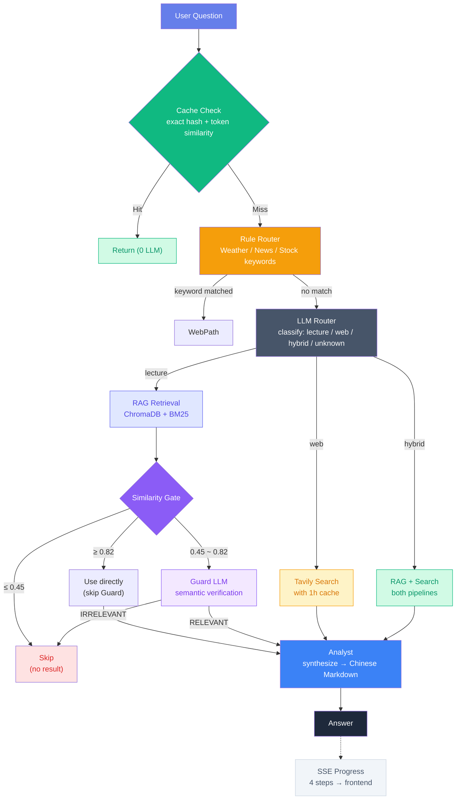
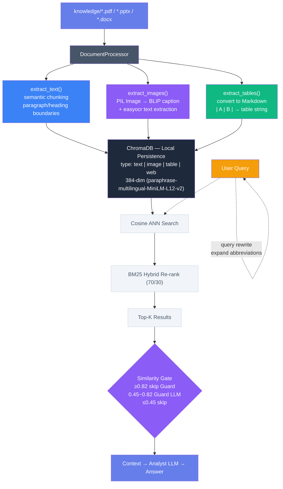
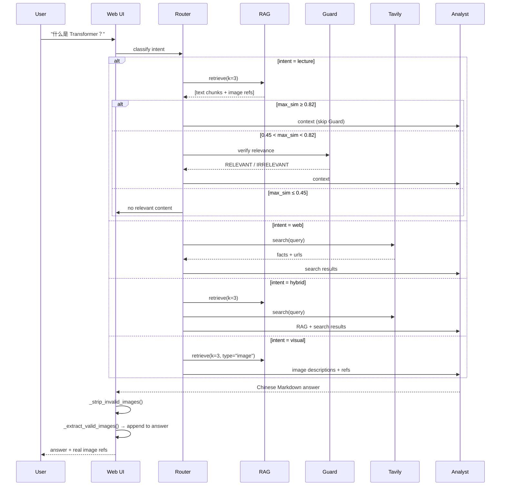
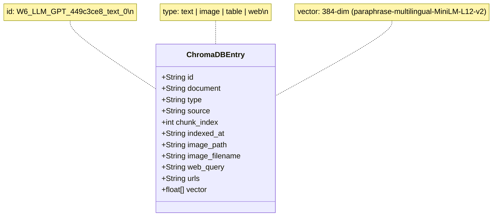
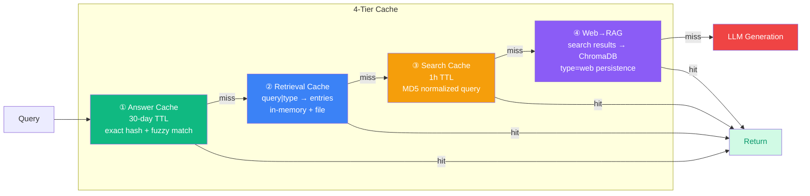

# LectureCrewLLM 架构图

[English](README.md) | [中文](README_CN.md) | [BUG_REPORT](BUG_REPORT.md) ｜ [架构图](picts/diagrams.md)

## 1. 请求处理流程 (Request Processing Pipeline)

---

## 2. 多模态 RAG 管道 (Multi-Modal RAG Pipeline)

---

## 3. Agent 交互序列 (Agent Interaction Sequence)

---

## 4. 数据存储结构 (Data Model)

---

## 5. 缓存层级 (Cache Hierarchy)

---